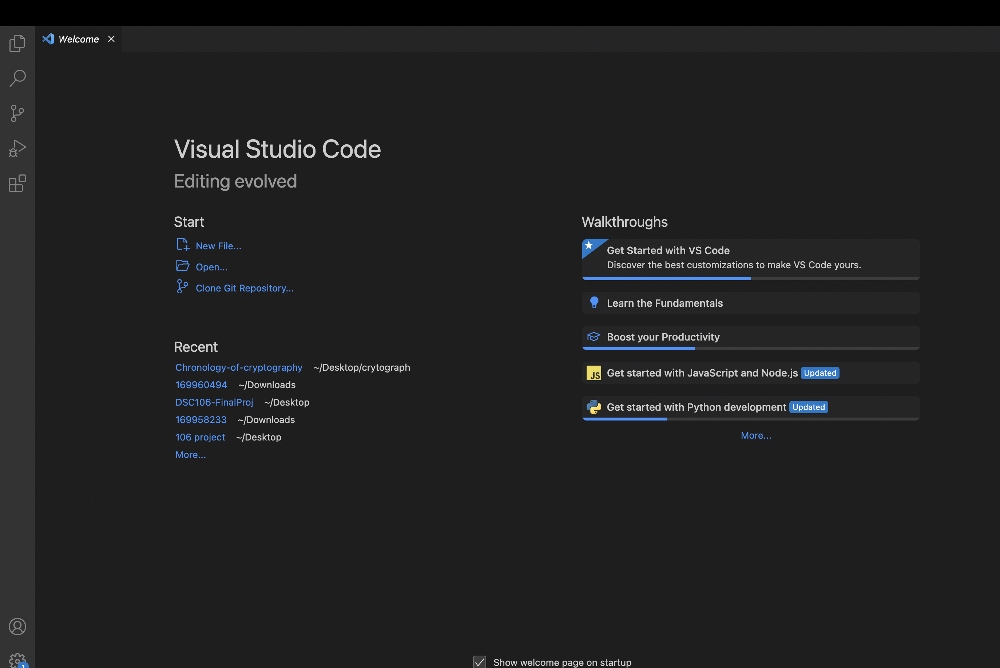
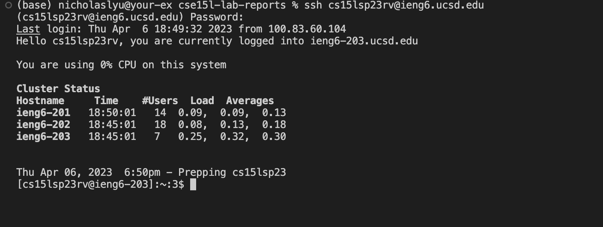
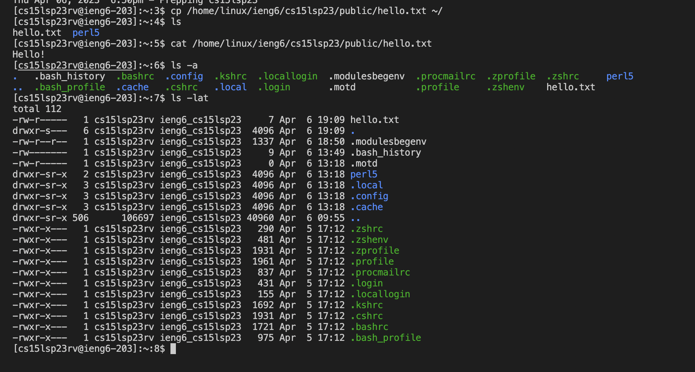

## Tutorial for Incoming CSE15L Students

### Step 1 Your CSE15L Account
Visit [https://sdacs.ucsd.edu/~icc/index.php](https://sdacs.ucsd.edu/~icc/index.php), and follow the instruction from here [Tutorial](https://drive.google.com/file/d/17IDZn8Qq7Q0RkYMxdiIR0o6HJ3B5YqSW/view) to lookup your account and reset your password.

### Step 2 Download VScode
Visit Visual Studio Code website [https://code.visualstudio.com/](https://code.visualstudio.com/), and follow the instructions to download and install it on your computer. Versions for Windows and Mac are both available.
**Note**: If you don't want to use or cannot your own machine, you can use the VScode on any computers from the lab room. 

When you successfully download and install Vscode. You will be able to open a window that looks like the screenshot below.

### Step 3 Remotely Connecting
In this section, we’ll see how to use VScode/terminal to connect to a remote computer over the Internet to do work there.
**For Windows Users**
If you have **Git** installed on your windows computer, you can ignore this step. 
Otherwise, go to [Git windows](https://gitforwindows.org/) to install **Git** to your machine.
Once installed, read this [post](https://stackoverflow.com/questions/42606837/how-do-i-use-bash-on-windows-from-the-visual-studio-code-integrated-terminal/50527994#50527994) to learn how to use the **git bash** in your VScode

**For Mac Users**
You can use **Terminal** from your softwares or open your **VScode** and open a new terminal to start typing your commands.

**To use ssh**
 To use ssh, in the terminal you opened in VScode. (Ctrl or Command + `, or use the Terminal → New Terminal menu option). 
 Then, type in 
 ``$ ssh youraccount@ieng6.ucsd.edu``

 For example: 
 cs15lsp23rv is my account name for CSE15L
 ``$ ssh cs15lsp23rv@ieng6.ucsd.edu``

 **Note**: when we write the $, that’s not for you to type in! It’s just a convention for how we write commands

 If this is the first you trying to connect to the remote server, you will see a warning message pops up. Type **yes** in the command line and press **Enter**. 

 Then you will see it is asking for your password. Type in your password correctly.
 When you successfully login, you will see the command line like the screenshot below. 
 

 **Note**: When you are entering your password, you wouldn't be able to see it. You can also copy and paste your password from otherwhere.
 
 
 ### Step 4 Run Some Commands
 Try running some commands **cd**, **ls**, **pwd**, **mkdir**, and **cp** a few times on both the remote computer and your local computer and observe the results.

 Here are some useful commands to try:
* <mark>cd ~</mark>
* <mark>cd</mark>
* <mark>ls -lat</mark>
* <mark>ls -at</mark>
* <mark>ls \<directory> </mark>where <mark>\<directory> </mark>is <mark>/home/linux/ieng6/cs15lsp23/cs15lsp23abc </mark>, where the abc is one of the other group members’ username
* <mark> cp /home/linux/ieng6/cs15lsp23/public/hello.txt ~/</mark>
* <mark>cat /home/linux/ieng6/cs15lsp23/public/hello.txt</mark>

**Note**: After you finish, you can type **Ctrl+D** or type **exit** in the command line to exit to your local machine.

