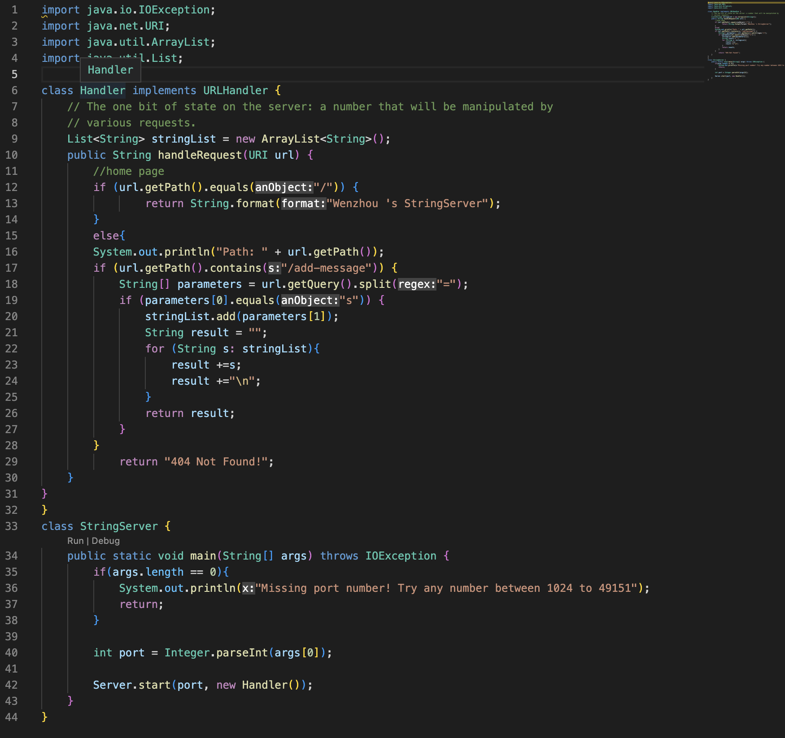
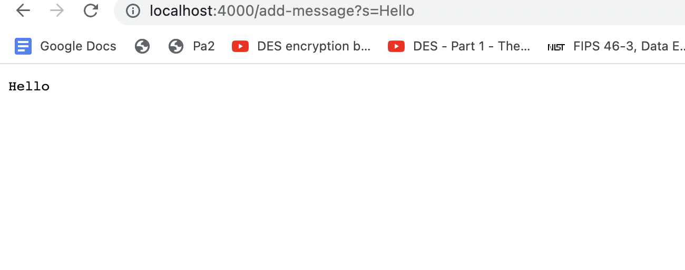
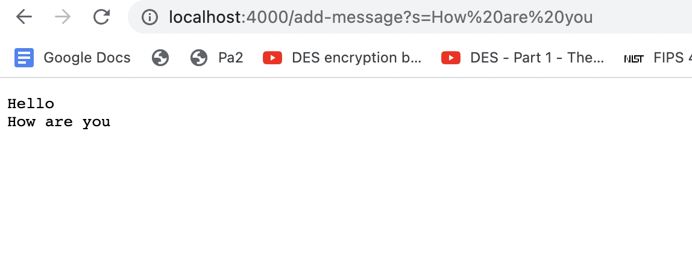
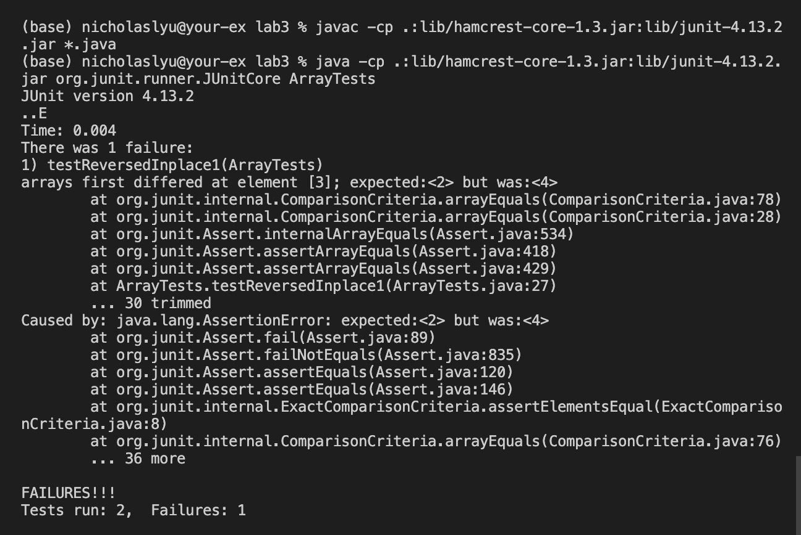

## Lab Report 2 - Servers and Bugs

### Part 1
Screenshot of ``StringServer.java``

**Request 1**
``/add-message?s=Hello``

**Request 2**
``/add-message?s=How are you``

* For both requests, method ``handleRequest`` is called, it has a parameter called ``url``
* For request 1, one argument passed in to the method is ``/add-message?s=Hello``; for request 2, one argument passed in to the method is ``/add-message?s=How%20are%20you``
* For each method, an array list ``stringlist`` was initialized empty. Another field called ``result`` was initialized as a empty string. No other fields exist in the class. 
* After execute **request 1**, a string ``Hello`` was appended to the ``stringlist`` array list. Now we loop through this array list, and concatenate all the elements in this array list to ``result``. Since we only has one element in the array list, so ``result = Hello``
* After execute **request 2**, a string ``How are you`` was appended to the ``stringlist`` array list, now ``stringlist`` has two elements (["Hello","How are you"]) then we loop through this array list, and concatenate all the elements in this array list to ``result``. Now ``result = Hello\nHow are you``, and it gets printed on the webpage.
**Note**: ``\n`` stands for a new line character, because we want to display the each string in a new line, so we add a new line character at the end of each string. 

### Part 2
Bug: ``reverseInPlace`` method in ``ArrayExamples.java``
**Failure-inducing input**
<pre><code>
    @Test
    public void testReversedInplace1(){
        int[] input1 = {1,2,3,4,5 };
        ArrayExamples.reverseInPlace(input1);
        assertArrayEquals(new int[]{ 5,4,3,2,1 }, input1);
    }
</code></pre>

**An input that doesn’t induce a failure**
<pre><code>
    @Test
    public void testReversedInplace2(){
        int[] input1 = {1,1,1,1};
        ArrayExamples.reverseInPlace(input1);
        assertArrayEquals(new int[]{ 1,1,1,1},  input1);
    }
</code></pre>

**The symptom**

**The Bug**
**Before**
<pre><code>
 static void reverseInPlace(int[] arr) {
    for(int i = 0; i < arr.length; i += 1) {
      arr[i] = arr[arr.length - i - 1];
    }
  }
</code></pre>

**After**
<pre><code>
  static void reverseInPlace(int[] arr) {
    for(int i = 0; i < arr.length/2; i += 1) {
      int temp=arr[i];
      arr[i] = arr[arr.length - i - 1];
      arr[arr.length-i-1] =temp;
    }
  }
</code></pre>

**How to fix**
The problem of this code is that it swaps element *n* times (n as the number of elements in the array). However, after **n/2** th swapping, the array is already reversed, and then the next **n/2** times swapping swap the array back to original one. 
To fix the problem, we only need to swap **n/2** times. 

### Part 3
I never learned how to start a local server using Java before. In week2's lab, we use the provided code to build our own servers, which is super exciting. I can further explore the code to figure out the mechanism of how it actually works.

