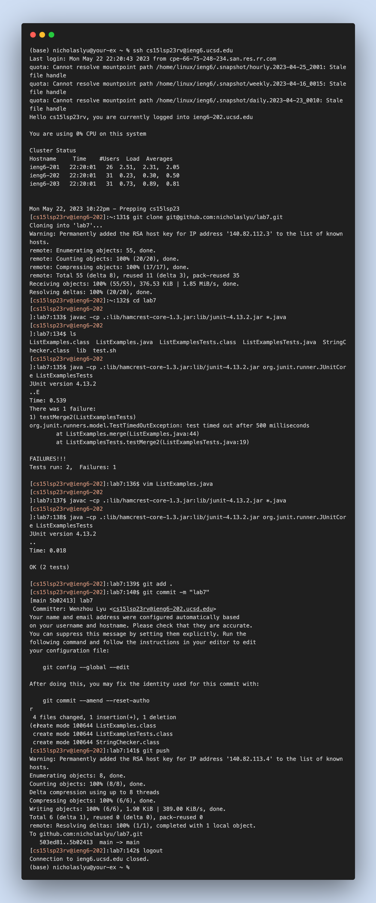

## Lab Report 4
**All steps are shown below**

**Step 4 Log into ieng6**
I opened my terminal and ``<Command+C>``"cs15lsp23rv@ieng6.ucsd.edu" from local then ``<Command+V>`` "cs15lsp23rv@ieng6.ucsd.edu" to the terminal and press ``<Enter>``. Since I already store keys in my local, so I don't need to type password.
``<Command+C>`` and ``<Command+V>`` stand for copy and paste.

**Step 5 Clone your fork of the repository from your Github account**
On Github page of lab7, I pressed ``<Command+C>`` "git@github.com:nicholaslyu/lab7.git" and typed "git clone" and pressed ``<Command+V>`` then pressed ``<Enter>``
Now, the repo is cloned to my ieng6 server.

**Step 6 Run the tests, demonstrating that they fail**
First, I typed ``cd lab7`` to change to the repo folder.
I typed ``<Command+C>``   ``javac -cp .:lib/hamcrest-core-1.3.jar:lib/junit-4.13.2.jar *.java`` from local and typed ``<Command+D>`` at the terminal and press ``<Enter>``
Next, I typed ``<Command+C>``   ``java -cp .:lib/hamcrest-core-1.3.jar:lib/junit-4.13.2.jar org.junit.runner.JUnitCore`` and typed ``<Command+V>`` at the terminal and typed ``<Space>``, then typed ``ListExamplesTest``, then pressed ``<Enter>``.
Tests would be run and the results would show.

**Step 7 Edit the code file to fix the failing test**
Pressed  ``<G>`` ``<?1>`` ``<Enter>`` ``<n>`` ``<r>`` ``<2>`` ``<Enter>``

I typed ``vim ListExamples.java`` and pressed ``<Enter>`` to open the java file.
Now we vim into the file, I pressed ``<G>`` to go the end of the file. Then typed ``<?1>`` to search the pattern of ``1`` backward from the end of the file. Pressed ``<Ener>``, then pressed ``<n>`` to search for the next matchded pattern. The second last ``1``was found.  Next, pressed ``<r>`` to allow replacing, and pressed ``2`` to replace ``1`` in the code. Finally, typed ``:w`` and pressed``<Ener>`` to save the changes, and typed  ``:q`` to exit the vim editor.

**Step 8 Run the tests, demonstrating that they now succeed**
Pressed ``<up>`` ``<up>`` ``<up>`` ``<Enter>``
and ``<up>`` ``<up>`` ``<up>`` ``<Enter>``. Since ``javac -cp .:lib/hamcrest-core-1.3.jar:lib/junit-4.13.2.jar *.java`` was 3 up in the command history, and ``java -cp .:lib/hamcrest-core-1.3.jar:lib/junit-4.13.2.jar org.junit.runner.JUnitCore ListExamplesTest`` was 3 up in the command history, so I used up arrow to access them with ease. All tests passed this time.

**Step 9 Commit and push the resulting change to your Github account (you can pick any commit message!)**
I typed ``git add .`` and pressed ``<Enter>`` to add changes to existing files to be commited. 
Then I typed ``git commit -m "lab7"`` and pressed ``<Enter>`` to commit the changes with message ``lab7``
Finally, I typed ``git push`` to push the changes to the remote repo on github.

**Time consumed: 3m36s**

