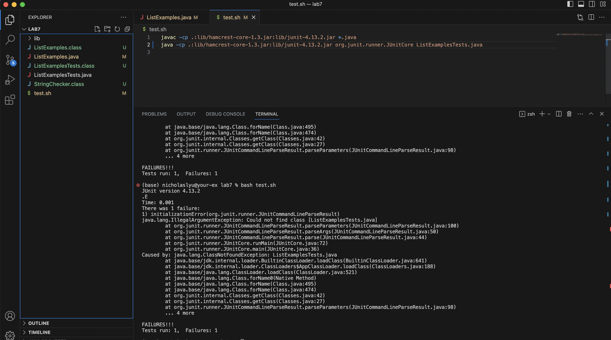
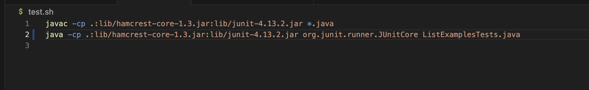
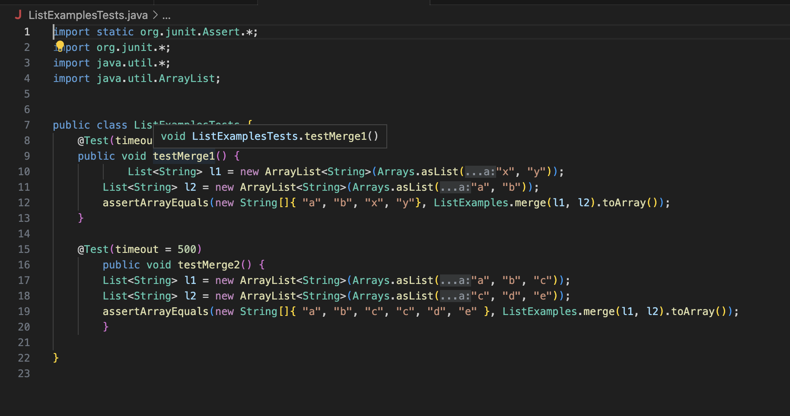
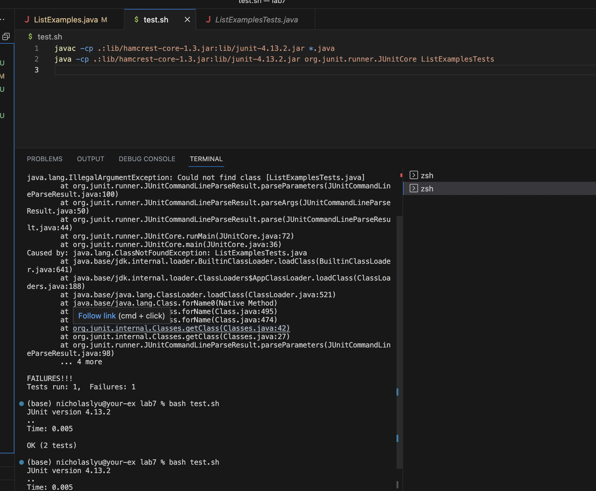
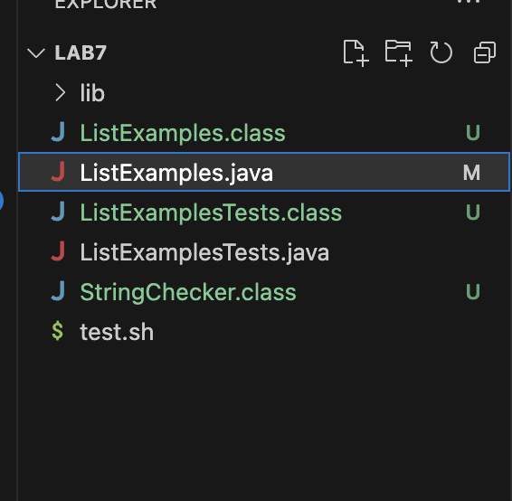
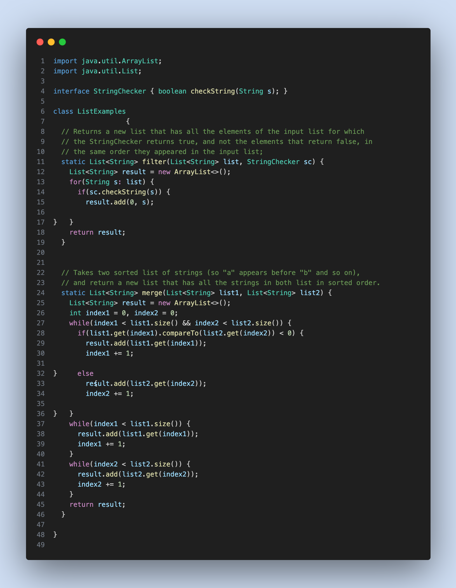

## Lab Report 5
### Debugging

**Student's post:**
Hi, I encountered an error when I tried to run the Junit tests. 

**What environment are you using (computer, operating system, web browser, terminal/editor, and so on)?**
I am using Mac/IOS system with Vscode to do my coding tasks.

**Detail the symptom you're seeing. Be specific; include both what you're seeing and what you expected to see instead. Screenshots are great, copy-pasted terminal output is also great. Avoid saying “it doesn't work”.**
So my problem is that when I tried to run the **test.sh** file, an **initializationError** pops out. 

**Detail the failure-inducing input and context. That might mean any or all of the command you're running, a test case, command-line arguments, working directory, even the last few commands you ran. Do your best to provide as much context as you can.**

I only ran ``$bash test.sh`` in the terminal. 
The screenshots are my junit tests and ``test.sh``. Anyone can help?

**TA's response:**
Please check your ``test.sh`` file, especially the second line. Did you run the ``java`` files correctly?

**Student's response**
Thanks! Now I fix it. I simply removed ``.java`` from the end of the second line in ``test.sh``. We shouldn't put ``.java`` at the end of the file we want to run using ``java`` command.
Now I run ``bash test.sh``, all the tests passed! Thank you!

**Setup information**
I used the repo from lab7 for this scenario.

The files structure is shown below.

Contents in each file:
``ListExamples.java``

``ListExamplesTests.java``

``test.sh``

Command to trigger the bug:
``$bash test.sh`` 

How to fix the bug:
Delete the ``.java`` at the end of ``java -cp .:lib/hamcrest-core-1.3.jar:lib/junit-4.13.2.jar org.junit.runner.JUnitCore ListExamplesTests.java``
in ``test.sh``
